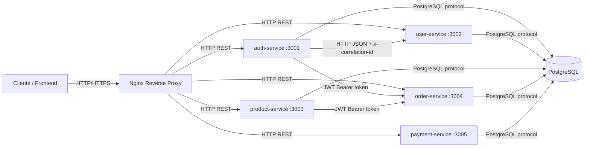

# Documento de Arquitetura Consolidado

**Projeto:** ecommerce-microservice  
**Data:** 24/04/2026  
**Status:** Proposto

## 1. Contexto e Problema

O projeto foi estruturado como um conjunto de microsserviços para suportar autenticação, cadastro de usuários, catálogo de produtos, pedidos e pagamentos. A solução atual usa uma instância PostgreSQL com segregação lógica por banco de dados, um gateway reverso via Nginx e comunicação HTTP entre os serviços.

O principal problema de arquitetura é equilibrar três objetivos ao mesmo tempo:

1. manter isolamento de domínio entre os serviços;
2. permitir integração simples entre autenticação e criação de perfis de usuário;
3. definir uma base mínima de confiabilidade, observabilidade e segurança para o sistema.

Hoje o Auth Service emite JWT após login, usa `correlationId` para rastreabilidade e notifica o User Service por HTTP quando um usuário é criado. Os demais serviços validam requisições por meio de headers HTTP e, quando necessário, por JWT compartilhado com a mesma chave configurada no ambiente.

## 2. Mapa de Bounded Contexts

### Auth Context

- Responsável por cadastro, login, emissão de JWT e orquestração inicial da criação de usuário.
- É a origem da identidade autenticada do sistema.
- Persiste dados de autenticação e usuário base.

### User Context

- Responsável pelo perfil funcional do usuário no domínio de usuários.
- Recebe notificações de criação e remoção vindas do Auth Service.
- Mantém os dados de perfil que não pertencem ao domínio de autenticação.

### Product Context

- Responsável pelo catálogo e estoque de produtos.
- Expõe endpoints HTTP para consulta e manutenção de produtos.
- Protege rotas com middleware de autenticação.

### Order Context

- Responsável por pedidos e itens de pedido.
- Valida token JWT no header `Authorization`.
- Mantém regras próprias de pedido sem depender de acesso direto ao contexto de autenticação.

### Payment Context

- Responsável por registrar pagamentos.
- Opera de forma isolada, persistindo dados no banco do próprio contexto.

### Infrastructure Context

- Responsável por Nginx, PostgreSQL, rede Docker e variáveis de ambiente.
- Faz o suporte transversal aos demais contextos.

## 3. Diagrama de Serviços e Protocolos de Comunicação

### Protocolos observados

- **HTTP/REST** entre cliente, Nginx e serviços.
- **HTTP JSON** entre Auth Service e User Service para notificação de criação e deleção.
- **JWT via header `Authorization: Bearer <token>`** para autenticação entre serviços que exigem identidade.
- **PostgreSQL** para persistência dos dados de cada contexto.
- **`x-correlation-id`** para rastreabilidade distribuída.

## 4. SLOs Definidos

Os SLOs abaixo são propostos para a parte de autenticação e para a plataforma como um todo. Eles devem ser medidos com base em janelas móveis de 30 dias.

### 4.1 Auth Service

- **Disponibilidade do `/health`:** 99,95%.
- **Sucesso do login:** 99,5% das requisições de autenticação devem retornar sucesso quando as credenciais estiverem corretas e os dependentes saudáveis.
- **Latência de login:** p95 abaixo de 400 ms.
- **Emissão de JWT:** 99,9% das respostas de login bem-sucedido devem conter token válido e expirável.

### 4.2 Comunicação Auth Service -> User Service

- **Entrega da notificação de criação de usuário:** 99,0%.
- **Latência da notificação HTTP:** p95 abaixo de 500 ms.
- **Rollback quando a notificação falhar:** 100% dos casos devem reverter o usuário criado no Auth Service quando o perfil não puder ser criado no User Service.

### 4.3 Plataforma

- **Disponibilidade do gateway Nginx:** 99,9%.
- **Health checks das APIs principais:** 99,9% de sucesso em janelas móveis.
- **Erro 5xx agregado:** abaixo de 1% do total de requisições.

### 4.4 Products (Análise com Carga de 50 Conexões)

Para validar a resiliência do microsserviço de Produtos, elevamos a carga do teste para **50 conexões simultâneas**, simulando um cenário de uso intenso e concorrência real no e-commerce.

#### 4.4.1 Definição de SLOs (Service Level Objectives)

Estes são os objetivos de nível de serviço estabelecidos como critérios de aceitação para o projeto:

| Métrica | Objetivo (SLO) | Descrição |
| :--- | :--- | :--- |
| **Latência (p95)** | `< 200ms` | 95% das requisições devem ser respondidas em menos de 200ms. |
| **Disponibilidade** | `99.9%` | Percentual mínimo de sucessos (respostas HTTP 2xx) esperado. |

#### 4.4.2 Resultados da Medição

Os dados obtidos através da ferramenta **Autocannon**, utilizando um token JWT válido para processamento completo da cadeia de middlewares, foram:

* **Latência p50 (Mediana):** 137 ms
* **Latência p97.5 (Aprox. p95):** 188 ms
* **Latência p99:** 230 ms
* **Throughput Médio:** 350,2 req/sec
* **Total de Requisições:** 4.000 (em 10.14s)
* **Status:** 0 erros detectados (Taxa de sucesso de 100%).

#### 4.4.3 Conclusão de Aderência

Mesmo sob uma carga significativamente maior e estresse de concorrência, o microsserviço de Produtos manteve-se **plenamente aderente ao SLO estabelecido**.

1.  **Conformidade de Latência:** O valor de **p95 (188ms)** situa-se dentro do limite de 200ms, demonstrando que o sistema mantém a fluidez mesmo em picos de acesso.
2.  **Resiliência:** Embora o p99 tenha atingido 230ms, o comportamento é considerado estável para o ambiente conteinerizado (Docker), sem degradação exponencial de performance.
3.  **Estabilidade Técnica:** A ausência total de erros de rede ou de aplicação (0 erros) comprova que o **Middleware de Autenticação**, a lógica de negócio e o **Pool de conexões com o PostgreSQL** estão devidamente dimensionados para lidar com acessos simultâneos.

A arquitetura mostra-se robusta e capaz de suportar o volume de tráfego proposto para o MVP do e-commerce.

## 5. Estratégias de Observabilidade

### Logging

- Usar logs estruturados em JSON no Auth Service, Product Service e Payment Service.
- Incluir `correlationId`, nome do serviço, nível do log e dados mínimos da operação.
- Evitar logar senha, token JWT completo e dados sensíveis de cartão ou pagamento.

### Correlação

- Propagar `x-correlation-id` entre os serviços.
- Gerar um novo `correlationId` apenas na borda quando o header não vier da requisição original.
- Usar o mesmo identificador em logs, erros e respostas HTTP para facilitar rastreio.

### Health checks

- Expor endpoint `/health` em Auth Service e Product Service.
- Validar conectividade com banco de dados no Auth Service.
- Considerar saúde como degradada quando houver falha de banco ou indisponibilidade do serviço dependente.

### Métricas recomendadas

- taxa de sucesso e erro por endpoint;
- latência p50, p95 e p99;
- quantidade de autenticações por minuto;
- quantidade de falhas de notificação para o User Service;
- tempo de resposta do health check.

### Tracing

- O sistema já possui uma base suficiente para rastreio lógico via `correlationId`.
- Se evoluir para OpenTelemetry, o `correlationId` deve ser alinhado ao trace id ou mapeado de forma consistente.

## 6. Estratégias de Segurança

### Autenticação

- JWT é o mecanismo central de autenticação entre serviços.
- O claim `sub` identifica o usuário autenticado.
- O segredo JWT deve ser compartilhado de forma segura por ambiente, nunca hardcoded em produção.

### Autorização

- Rotas protegidas devem validar o header `Authorization` antes de executar regras de negócio.
- O token deve ser validado quanto à assinatura e expiração antes de qualquer uso do payload.

### Proteção de dados

- Senhas devem continuar sendo armazenadas com hash bcrypt.
- Variáveis sensíveis devem permanecer em `.env` ou em secret manager equivalente.
- Respostas de erro não devem expor detalhes internos em produção.

### Segurança de transporte

- Em produção, a comunicação externa deve ocorrer por HTTPS.
- O Nginx deve atuar como ponto único de entrada para o tráfego externo.

### Higiene operacional

- Não registrar segredos, tokens completos ou credenciais em logs.
- Manter `correlationId` para auditoria, mas nunca tratá-lo como identidade de negócio.