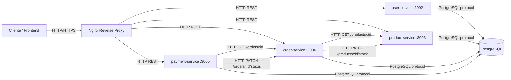

# Documento de Arquitetura Consolidado

**Projeto:** ecommerce-microservice  
**Data:** 24/04/2026  
**Status:** Proposto

## 1. Contexto e Problema

O projeto foi estruturado como um conjunto de microsserviços para suportar cadastro de usuários, catálogo de produtos, pedidos e pagamentos. A solução atual usa uma instância PostgreSQL com segregação lógica por banco de dados, um gateway reverso via Nginx e comunicação HTTP entre os serviços.

O principal problema de arquitetura é equilibrar três objetivos ao mesmo tempo:

1. manter isolamento de domínio entre os serviços;
2. definir uma base mínima de confiabilidade, observabilidade e segurança para o sistema.

## 2. Mapa de Bounded Contexts

### User Context

- Responsável pelo cadastro e perfil funcional do usuário.
- Mantém os dados de identificação do usuário no sistema.

### Product Context

- Responsável pelo catálogo e estoque de produtos.
- Expõe endpoints HTTP para consulta e manutenção de produtos.
- Protege rotas com middleware de autenticação.

### Order Context

- Responsável por pedidos e itens de pedido.
- Valida token JWT no header `Authorization`.
- Mantém regras próprias de pedido sem depender de acesso direto ao contexto de autenticação.

### Payment Context

- Responsável por registrar pagamentos.
- Opera de forma isolada, persistindo dados no banco do próprio contexto.

### Infrastructure Context

- Responsável por Nginx, PostgreSQL, rede Docker e variáveis de ambiente.
- Faz o suporte transversal aos demais contextos.

## 3. Diagrama de Serviços e Protocolos de Comunicação

```mermaid
flowchart LR
  Client[Cliente / Frontend] -->|HTTP/HTTPS| Nginx[Nginx Reverse Proxy]

  Nginx -->|HTTP REST| User[user-service :3002]
  Nginx -->|HTTP REST| Product[product-service :3003]
  Nginx -->|HTTP REST| Order[order-service :3004]
  Nginx -->|HTTP REST| Payment[payment-service :3005]

  Order -->|HTTP GET /products/:id| Product
  Order -->|HTTP PATCH /products/:id/stock| Product
  Payment -->|HTTP GET /orders/:id| Order
  Payment -->|HTTP PATCH /orders/:id/status| Order

  User -->|PostgreSQL protocol| DB[(PostgreSQL)]
  Product -->|PostgreSQL protocol| DB
  Order -->|PostgreSQL protocol| DB
  Payment -->|PostgreSQL protocol| DB
```

### Protocolos observados

- **HTTP/REST** entre cliente, Nginx e serviços.
- **HTTP JSON** entre serviços para consultas e notificações de estado (detalhado em ADR 003).
- **PostgreSQL** para persistência dos dados de cada contexto.
- **`x-correlation-id`** para rastreabilidade distribuída.

## 4. SLOs Definidos

Os SLOs abaixo são propostos para a parte de autenticação e para a plataforma como um todo. Eles devem ser medidos com base em janelas móveis de 30 dias.

### 4.1 Plataforma

- **Disponibilidade do gateway Nginx:** 99,9%.
- **Health checks das APIs principais:** 99,9% de sucesso em janelas móveis.
- **Erro 5xx agregado:** abaixo de 1% do total de requisições.

### 4.2 Products (Análise de Performance - Carga de 80 Conexões)

Para validar a resiliência e a capacidade de escala do microsserviço de Produtos, elevamos a carga do teste para **80 conexões simultâneas**, simulando um cenário de tráfego agressivo no nosso E-commerce.

#### 4.2.1 Definição de SLOs (Service Level Objectives)

Estes são os objetivos de nível de serviço estabelecidos como critérios de aceitação para o projeto:

| Métrica | Objetivo (SLO) | Descrição |
| :--- | :--- | :--- |
| **Latência (p95)** | `< 400ms` | 95% das requisições devem ser respondidas em menos de 400ms. |
| **Disponibilidade** | `99.9%` | Percentual mínimo de sucessos (respostas HTTP 2xx) esperado. |

#### 4.2.2 Resultados da Medição

Os dados obtidos através da ferramenta **Autocannon**, operando sob alta concorrência e utilizando validação via JWT, foram:

* **Latência p50 (Mediana):** 117 ms
* **Latência p97.5 (Aprox. p95):** 152 ms
* **Latência p99:** 219 ms
* **Throughput Médio:** 665,8 req/sec
* **Total de Requisições:** 7.000 (em 10.12s)
* **Status:** 0 erros detectados (Taxa de sucesso de 100%).

#### 4.2.3 Conclusão de Aderência

Mesmo com o aumento expressivo na carga de trabalho para 80 conexões simultâneas, o microsserviço de Produtos superou as expectativas, mantendo-se **plenamente aderente aos SLOs**.

1. **Alta Performance vs. Meta:** O valor de **p95 (152ms)** é significativamente inferior ao limite estabelecido de **400ms**, demonstrando que o sistema opera com uma margem de segurança de mais de 60% em relação ao objetivo mínimo.
2. **Estabilidade em Escala:** O sistema manteve uma média de **665 requisições por segundo** sem qualquer degradação que aproximasse os resultados do limite do SLO.
3. **Robustez Técnica:** A ausência total de erros (0 erros) sob este nível de estresse confirma que o gerenciamento de recursos no **Docker** e a eficiência do **NGINX** como Gateway permitem que o Node.js processe as requisições de forma estável e segura.

A arquitetura demonstra maturidade técnica para suportar picos de acesso significativos, garantindo a integridade e a fluidez do MVP mesmo sob condições de estresse severo.

## 5. Estratégias de Observabilidade

### Logging

- Usar logs estruturados em JSON no User Service, Product Service e Payment Service.
- Incluir `correlationId`, nome do serviço, nível do log e dados mínimos da operação.
- Evitar logar senha, token JWT completo e dados sensíveis de cartão ou pagamento.

### Correlação

- Propagar `x-correlation-id` entre os serviços.
- Gerar um novo `correlationId` apenas na borda quando o header não vier da requisição original.
- Usar o mesmo identificador em logs, erros e respostas HTTP para facilitar rastreio.

### Health checks

- Expor endpoint `/health` em todos os serviços.
- Validar conectividade com banco de dados em cada health check.
- Considerar saúde como degradada quando houver falha de banco ou indisponibilidade de serviço dependente.

### Métricas recomendadas

- taxa de sucesso e erro por endpoint;
- latência p50, p95 e p99;
- tempo de resposta do health check.

### Tracing

- O sistema já possui uma base suficiente para rastreio lógico via `correlationId`.
- Se evoluir para OpenTelemetry, o `correlationId` deve ser alinhado ao trace id ou mapeado de forma consistente.

## 6. Estratégias de Segurança

### Autenticação

- A estratégia de autenticação do sistema é responsabilidade do User Service.
- Caso JWT seja adotado, o claim `sub` deve identificar o usuário autenticado e o segredo deve ser gerenciado por variável de ambiente, nunca hardcoded.

### Autorização

- Rotas protegidas devem validar o header `Authorization` antes de executar regras de negócio.
- O token deve ser validado quanto à assinatura e expiração antes de qualquer uso do payload.

### Proteção de dados

- Senhas devem ser armazenadas com hash bcrypt.
- Variáveis sensíveis devem permanecer em `.env` ou em secret manager equivalente.
- Respostas de erro não devem expor detalhes internos em produção.

### Segurança de transporte

- Em produção, a comunicação externa deve ocorrer por HTTPS.
- O Nginx deve atuar como ponto único de entrada para o tráfego externo.

### Higiene operacional

- Não registrar segredos, tokens completos ou credenciais em logs.
- Manter `correlationId` para auditoria, mas nunca tratá-lo como identidade de negócio.